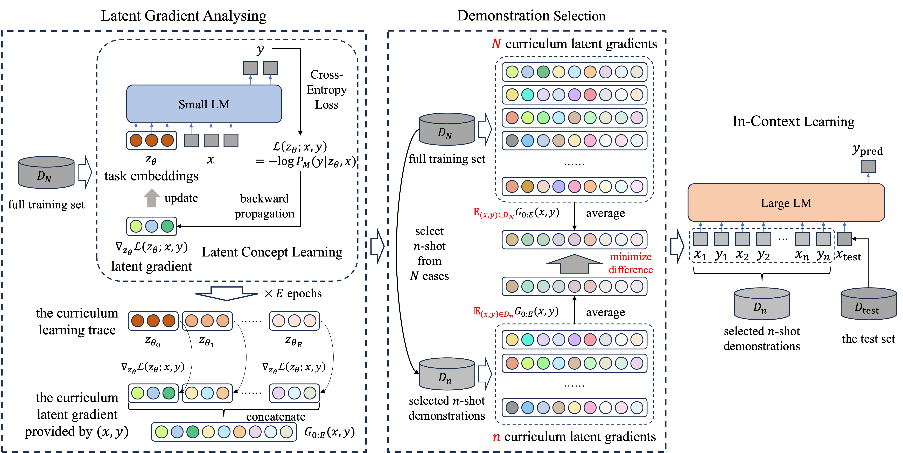

This project contains the source code of **Selecting Demonstrations for Many-Shot In-Context Learning via Gradient Matching**. This is built upon the project of [**CEIL**](https://github.com/HKUNLP/icl-ceil) (for few-shot demonstration selection). Thanks for sharing such high-quality project.



## Project Outline
- [src](src): source code for datasets and metrics definition, mostly borrowed from [**CEIL**](https://github.com/HKUNLP/icl-ceil).
- [train_prefix.py](train_prefix.py): for Latent Concept Learning.
- [compute_prefix_grad_all_checkpoints.py](compute_prefix_grad_all_checkpoints.py): for Latent Gradient Computation.
- [condense_tensor.py](condense_tensor.py): for Gradient Matching.
- [shared_context_finder.py](shared_context_finder.py): for Demonstration Selection (including various methods).
- [download_datasets.py](download_datasets.py): for dataset preparation.
- [dense_retriever.py](dense_retriever.py): for EPR retriever training / calling (please refer to [**CEIL**](https://github.com/HKUNLP/icl-ceil) for more details).
- [utils_training.py](utils_training.py): some tools integration for DeepSpeed + Huggingface Trainer.
- [modeling_llama_prefix_tuning.py](modeling_llama_prefix_tuning.py): the prefix-tuning extension for Llama3 series LLMs.
- [modeling_qwen2_prefix_tuning.py](modeling_qwen2_prefix_tuning.py): the prefix-tuning extension for Qwen2.5 series LLMs.
- [inferencer_fast.py](inferencer_fast.py): vLLM offline inference for Many-Shot ICL evaluation on local LLMs.
- [inferencer_api.py](inferencer_api.py): API calling for Many-Shot ICL evaluation on online LLMs.

## Quick Start
For environment (to be verified):
```python
python3 -m pip install -r requirements.txt
```

For our proposed CLG:
```python
deepspeed train_prefix.py --task_name sst5 --model_name Qwen2.5-3B
accelerate launch --num_processes 8 compute_prefix_grad_all_checkpoints.py --task_name sst5 --model_name Qwen2.5-3B
python3 shared_context_finder.py --method latent_grad --task_name sst5 --model_name Qwen2.5-3B
```

For random selection:
```python
python3 shared_context_finder.py --method random --task_name sst5 --model_name Qwen2.5-3B
```

For Best-of-5 selection (requires vLLM):
```python
python3 shared_context_finder.py --method best_of_5 --task_name sst5 --model_name Qwen2.5-3B
```

For Latent-Bayesian selection:
```python
python3 shared_context_finder.py --method latent_post --task_name sst5 --model_name Qwen2.5-3B
```

For BGE-KMeans selection (requires FlagEmbedding):
```python
python3 shared_context_finder.py --method dense_bge_kmeans --task_name sst5 --model_name Qwen2.5-3B
```

For EPR-KMeans selection (requires EPR encoder training, please refer to [**CEIL**](https://github.com/HKUNLP/icl-ceil) for more details):
```python
python3 shared_context_finder.py --method dense_epr_kmeans --task_name sst5 --model_name Qwen2.5-3B
```

For BM25-Major selection:
```python
python3 shared_context_finder.py --method bm25 --task_name sst5 --model_name Qwen2.5-3B
```


I have deleted some sensitive information and some unused code in the original project. If you have trouble in running this, please don't hesitate to contact me or write an issue.